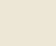
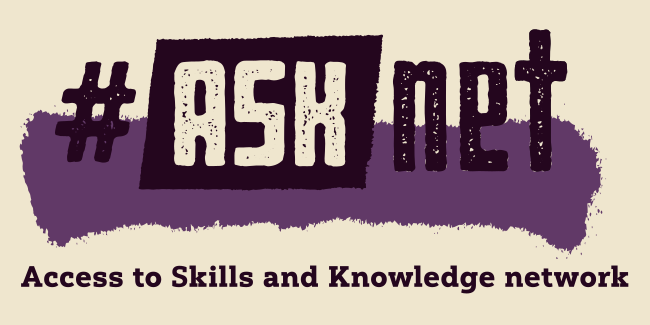
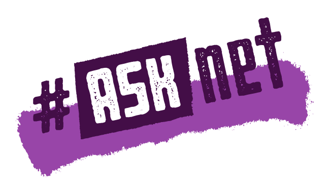

# ASKnet-Design
This repository includes the corporate design infos (colors, fonts, logo) of the #ASKnet websites and print materials.

More about [#ASKnet](https://asknet.community/) here.

# **Color scheme + Hex Color Codes:**

### Purple (main) *connotation: imagination, wisdom, creativity, uplifting*

*  Dark Purple #30002A — Background, Headings
*  Light Purple #8F747F — Background

### Ochre/Yellow (main) *connotation: youthful, fresh, earthy*

*  Ochre #C5A14B — Design Elements, Background
*  Light Ochre #EEE7D4 — Background

### Black & White (graphics)

*  Font and graphics: #231F20 

# **Fonts used:**

### Print

* *Yorkten Slab* — headings
* *Interstate Condensed (light and regular)* — text blocks

### Website

* *Montserrat* — headings
* *Noto Serif* — text blocks

# **Logos:**

 

# License Note
- [CC-BY-SA 4.0 International License](/LICENSE.md) via [#ASKnet](https://asknet.community)
- Original Color inspiration from [Open Documentation Guide](https://github.com/opencultureagency/Open-Documentation-Guide/)
- **Complete Redesign 2.0** (main) based on original Legacy Design Branch - November 2023 Website
- Other Platforms refer to old 1.x Release Branch (legacy)
